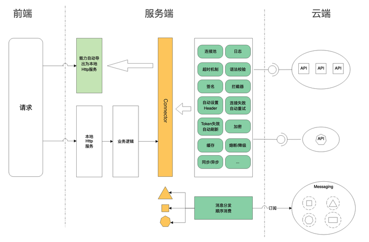
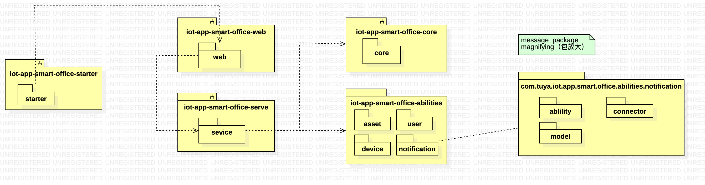
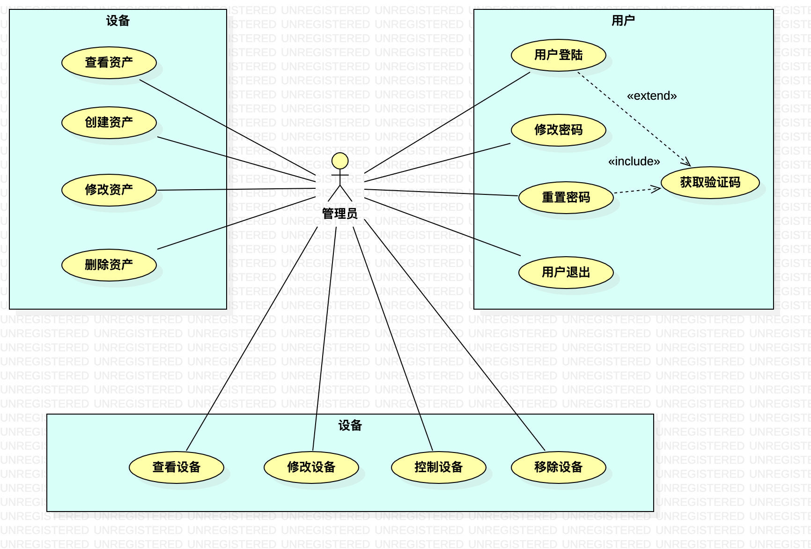
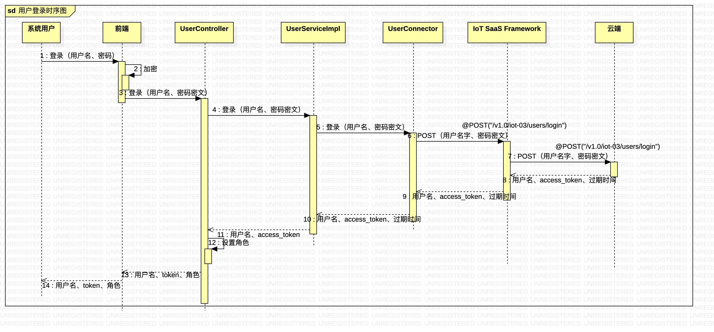

# 管控台
## 统一管理平台环境信息
## 目标
实践云端行业能力，验证SaaS开发框架功能，沉淀能力丰富、灵活可扩展的IoT统一管控台。
## 研发体系
基于SaaS开发框架的云云对接研发体系

## 迭代
| 版本   |  时间节点 | 能力   | 相关文档  |  问题 |
| ------------ | ------------ | ------------ | ------------ | ------------ |
|  V1 |  需求评审 - 4.7 UI评审 - 4.13 技术评审 - 4.16 测试用例评审 - 4.19 联调时间 - 4.16 提测时间 - 4.21 上线时间 - 4.27 |  资产、用户、设备 | [PRD](https://wiki.tuya-inc.com:7799/pages/viewpage.action?pageId=89527987" "PRD") 、[原型](https://ux.tuya-inc.com:7799/app/c4Ik7xs8E1Q/specs/ABzVQuUIj1p/HxVImhfuGWIx " "原型") （账号：pd02@tuya.com ，密码：Tuya.20210318）、 |  云端 资产&用户授权体系需要详细规划，涉及到子资产的授权机制 |

## 主要技术设计
### 项目结构

### 用例

### 交互

逻辑描述：

用户输入用户及密码，点击登录按钮。
前端对密码进行加密，并将登录信息发送给后端服务。
用户服务实现类调用用户连接器的登录方法。
用户连接器封装接口（/v1.0/iot-03/users/login）的请求数据并调用该接口。
IoT SaaS Framework将用户连接器的请求转发到云端并返回登录的相关信息（用户名、access_token、过期时间）。

